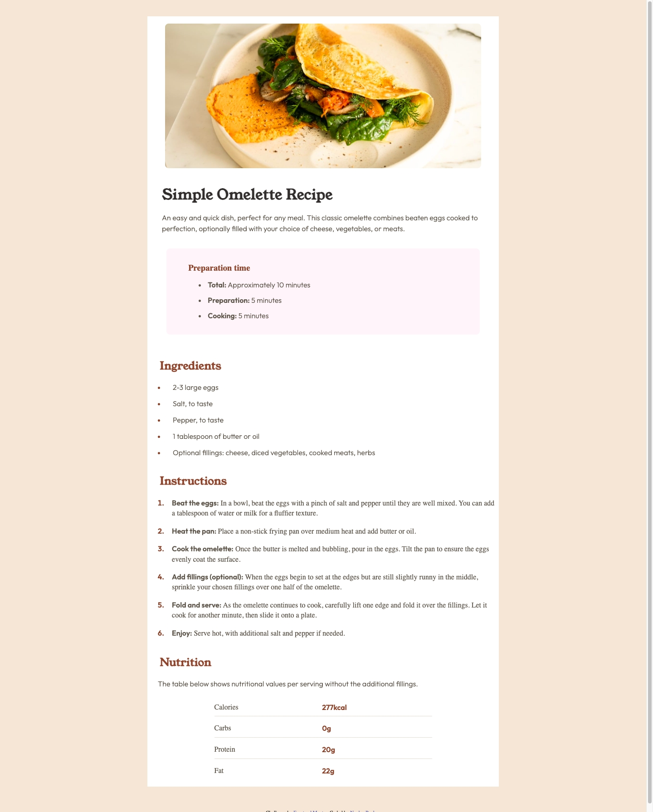

# Frontend Mentor - Recipe page solution

This is a solution to the [Recipe page challenge on Frontend Mentor](https://www.frontendmentor.io/challenges/recipe-page-KiTsR8QQKm). Frontend Mentor challenges help you improve your coding skills by building realistic projects. 

## Table of contents

- [Overview](#overview)
  - [The challenge](#the-challenge)
  - [Screenshot](#screenshot)
  - [Links](#links)
- [My process](#my-process)
  - [Built with](#built-with)
  - [What I learned](#what-i-learned)
- [Author](#author)

**Note: Delete this note and update the table of contents based on what sections you keep.**

## Overview

### Screenshot

- Desktop screenshot
- Mobile screenshot

### Links

- Solution URL: [Solution repo](https://github.com/naglorias/recipe-page.git)
- Live Site URL: [Live site](https://naglorias.github.io/recipe-page/)

## My process

### Built with

- Semantic HTML5 markup
- CSS custom properties
- Flexbox
- CSS Grid
- Mobile-first workflow

**Note: These are just examples. Delete this note and replace the list above with your own choices**

### What I learned

- I learned to use different types of list element(ordered and unordered);

- I learned how to create table and style it as I wish;

## Author

- Website - [Github profile](https://github.com/naglorias)
- Frontend Mentor - [@naglorias](https://www.frontendmentor.io/profile/naglorias)
- Twitter - [@naglaaS_](https://twitter.com/naglaaS_)

**Note: Delete this note and add/remove/edit lines above based on what links you'd like to share.**

